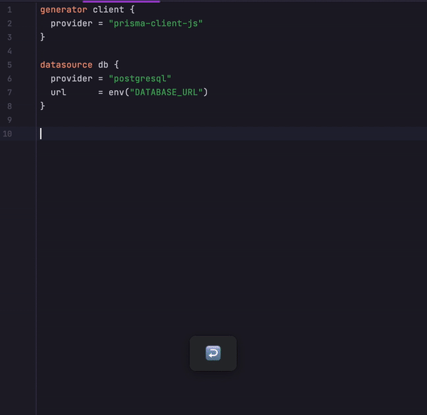

# Prettier plugin for [Prisma](https://github.com/prisma/prisma)

[](https://github.com/umidbekk/prettier-plugin-prisma/actions/workflows/main.yml)
[](https://packagephobia.com/result?p=prettier-plugin-prisma)
[](https://www.npmjs.com/package/prettier-plugin-prisma)
[](https://www.npmjs.com/package/prettier-plugin-prisma)



### Installation

```bash
npm i -D prettier-plugin-prisma
# or with yarn
yarn add -D prettier-plugin-prisma
```

### Feature requests

This library is built on top of official [prisma-fmt-wasm](https://github.com/prisma/prisma-engines/tree/main/prisma-fmt-wasm),
and all new features are developed there: https://github.com/prisma/prisma-engines/issues?q=fmt

### Supported options

- Tab width: https://prettier.io/docs/en/options.html#tab-width
